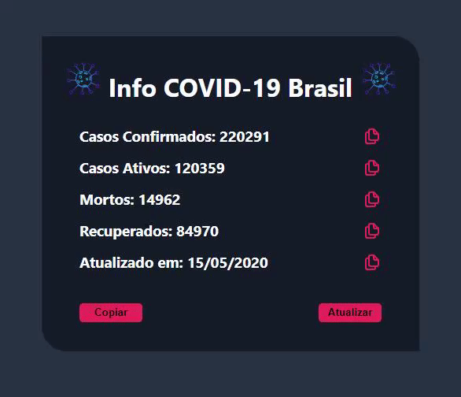

<h1 align="center">Simple COVID-19 Info</h1>
<h4 align="center">
   
</h4>

  <a href="#wrench-built-with">Built With</a>&nbsp;&nbsp;&nbsp;|&nbsp;&nbsp;&nbsp;
  <a href="#page_facing_up-about">About</a>&nbsp;&nbsp;&nbsp;|&nbsp;&nbsp;&nbsp;
  <a href="#-how-to-use">How to Use</a>&nbsp;&nbsp;&nbsp;|&nbsp;&nbsp;&nbsp;
  <a href="#-how-to-contribute">How to Contribute</a>&nbsp;&nbsp;&nbsp;|&nbsp;&nbsp;&nbsp;
  <a href="#pencil-author">Author</a>

## :wrench: Built With

- [React](https://reactjs.org)
- [Axios](https://github.com/axios/axios)

#### Data from: https://api.covid19api.com

## :page_facing_up: About

This is a simple web page to show the current situation of COVID-19 in Brazil.

## 💻 How to Use

- Clone the project: `git clone https://github.com/Lukazovic/simple-covid19-info.git`;
- Go to the project folder: `cd simple-covid19-info`;
- Download the dependencies: `yarn install`;
- Start the application: `yarn start`.

It will open a browser page (if it doesn't, go to [http://localhost:3000](http://localhost:3000/)).

## 🤔 How to Contribute

- Fork this repository;
- Create your branch with your feature: `git checkout -b my-feature`;
- Commit your feature: `git commit -m 'feat: My new feature'`;
- Push to your branch: `git push origin my-feature`.

Then merge your pull request, you can now delete your branch

## :pencil: Author

<table>
  <tr>
    <td align="center"><a href="https://github.com/Lukazovic"> <b>Lucas Vieira</b></a> </td>
  <tr>
</table>
